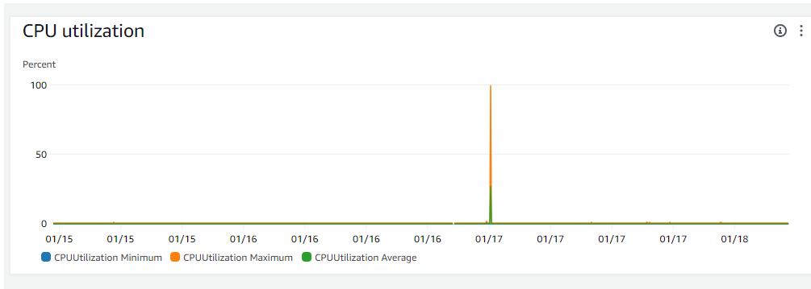

# Migrating from Netlify to AWS ECS

### Charles Johnson, Software Engineer

#### 1-17-2023

---

Over the last few days I’ve been moving this website (the one you’re on right now!) from Netlify to Amazon Web Services (AWS).  This site is currently a frontend-only React site using Vite as its build tool.  The outputs are static assets including an index.html file, bundled JS files, and image files.  Netlify is great for hosting a site like this because you can just point it at a GitHub repo and it will automatically build and deploy your code.  But I wanted to get some more experience with AWS, Terraform, and Docker under my belt, so I began working to make that happen.

My requirements for the new setup were:
- Use AWS and more specifically ECS (Elastic Container Service) to host the site
- Use Terraform to manage the AWS infrastructure, allowing me to easily tear down or rebuild the infrastructure with a single command
- Use Docker to containerize the app
- The site works the same as before, and is accessible at my domain name


Here is a log of the steps I took and the results.

// todo: Benefits of Terraform, infrastructure as code
// todo: mention S3 as alternative

## Dockerizing the app

With Netlify hosting, I didn’t have to worry about the server because Netlify did that for me.  But if I want the site to run in a docker container, a web server is needed.  Vite is a great build tool, but it doesn’t include a production server for hosting its outputs.  So I decided to use one of the most popular and trusted web servers: Nginx.  For this we just need a configuration file that tells Nginx where to find the static assets.  Here is the one I used:

```nginx:nginx.conf
server {
    listen       80;
    server_name  localhost;

    location / {
        root   /usr/share/nginx/html;
        index  index.html index.htm;
        try_files $uri /index.html;
    }

    error_page   500 502 503 504  /50x.html;
    location = /50x.html {
        root   /usr/share/nginx/html;
    }
}
```

Next I created a Dockerfile to build and host the app:
    
```docker:Dockerfile
# Step 1: Build the application
# Use an official Node runtime as a parent image
FROM node:20.10 as build

# Set the working directory in the container
WORKDIR /app

# Copy the package.json files from your project into the container
COPY package*.json ./
COPY public/ public/
COPY src/ src/

# Install any needed packages specified in package.json
RUN npm install

# Bundle app source inside the Docker image
COPY . .

# Build the app for production
RUN npm run build

# Step 2: Serve the application
FROM nginx:alpine

# Copy the nginx config
COPY nginx.conf /etc/nginx/conf.d/default.conf

# Copy the build from the previous stage
COPY --from=build /app/dist /usr/share/nginx/html

# Open port to the outside world
EXPOSE 80

# Start nginx
CMD ["nginx", "-g", "daemon off;"]
```

I built and tested the image locally and it worked great.

```
docker build . -t cj-cafe:latest
docker run -p 80:80 --name cj-cafe-container cj-cafe:latest
```


Finally, I tagged and pushed the image to Docker Hub, which allows us to pull down the image and run it on ECS. 

```
docker tag cj-cafe:latest devcjohn/cj-cafe:latest
docker push devcjohn/cj-cafe:latest
```

An alternative to DockerHub is Amazon Elastic Container Repository (ECR), but I didn’t want to have to program around a small problem: Terraform doesn’t want to destroy an ECR repo with images inside it, so tearing down and rebuilding the AWS infrastructure would require special logic.


## Installing Configuring Terraform
I installed the Terraform CLI and configured it to use my AWS credentials.
I created a directory for terraform and created the first file **main.tf.**  Later I split this file into several different ones, but for now I just wanted to get something working.  There was a lot of trial and error, and I don't want to give you the impression I wrote each of these files in one pass.
But I'll only be showing you the final files in this blog post for brevity.

## Providers and Variables
Terraform works with many different cloud providers including Azure and Google Cloud, but we just need to add 'hashicorp/aws' as a provider.  I set the region to 'us-east-2' since its the closest to me and the people who are likely to visit it.  A variables file
is a common strategy for storing values that are accessed multiple times, and will make adding a second environment easier, if I ever need to do that.

```hcl:providers.tf
terraform {
  required_providers {
    aws = {
      source  = "hashicorp/aws"
      version = "~> 5.31"
    }
  }

  required_version = ">= 1.6.5"
}

provider "aws" {
  region = "us-east-2"
}
```


```hcl:variables.tf
variable "region" {
  type        = string
  description = "AWS region"
  default     = "us-east-2"
}

variable "domain_name" {
  type        = string
  description = "The domain name the app is accessable from"
  default     = "cj.cafe"
}

variable "ecs_log_group" {
  type        = string
  description = "CloudWatch log group name"
  default     = "ecs/esc-cj-cafe"
}

variable "docker_image" {
  type        = string
  description = "Docker image to deploy"
  default     = "devcjohn/cj-cafe:latest"
}
```

## VPC
The meat of terraform code is the resource block. Each one creates a resource in AWS.
I started with a VPC (Virtual Private Cloud) as it is required to allow traffic into and out of AWS.
I created a security group to allow in HTTP and HTTPS traffic, and to allow services in the VPC to egress on any port.
I also added an internet gateway so the app can communicate with the internet outside of AWS.
Later I added a security group to allow traffic from the load balancer to the ECS service, which we will cover in a later step.


```hcl:vpc.tf
resource "aws_vpc" "my-vpc" {
  cidr_block       = "10.0.0.0/16"
  instance_tenancy = "default"

  tags = {
    Name    = "my-vpc"
    Project = "cj-cafe"
  }
}

resource "aws_subnet" "subnet-1" {
  vpc_id            = aws_vpc.my-vpc.id
  availability_zone = "us-east-2a"
  cidr_block        = "10.0.1.0/24"

  tags = {
    Name    = "subnet-1"
    Project = "cj-cafe"
  }
}

resource "aws_subnet" "subnet-2" {
  vpc_id            = aws_vpc.my-vpc.id
  availability_zone = "us-east-2b"
  cidr_block        = "10.0.2.0/24" // must be different from subnet-1's cidr_block

  tags = {
    Name    = "subnet-2"
    Project = "cj-cafe"
  }
}

// Associate the Route Tables with the subnets
resource "aws_route_table_association" "subnet_1_association" {
  subnet_id      = aws_subnet.subnet-1.id
  route_table_id = aws_route_table.public_route_table.id
}

resource "aws_route_table_association" "subnet_2_association" {
  subnet_id      = aws_subnet.subnet-2.id
  route_table_id = aws_route_table.public_route_table.id
}

resource "aws_security_group" "allow_web" {
  name        = "allow_web_traffic"
  description = "Allow web inbound traffic"
  vpc_id      = aws_vpc.my-vpc.id

  ingress {
    description = "HTTP (port 80)"
    from_port   = 80
    to_port     = 80
    protocol    = "tcp"
    cidr_blocks = ["0.0.0.0/0"]
  }

  ingress {
    description = "HTTPS (port 443)"
    from_port   = 443
    to_port     = 443
    protocol    = "tcp"
    cidr_blocks = ["0.0.0.0/0"]
  }

  ingress {
    description = "ICMP (ping)"
    from_port   = -1
    to_port     = -1
    protocol    = "icmp"
    cidr_blocks = ["0.0.0.0/0"]
  }

  egress {
    from_port   = 0
    to_port     = 0
    protocol    = "-1"
    cidr_blocks = ["0.0.0.0/0"]
  }

  tags = {
    Name    = "allow_tls"
    Project = "cj-cafe"
  }
}

// A security group is needed to allow the Load Balancer to access the ECS service.
// We want all traffic to the ECS service to come from the Load Balancer
resource "aws_security_group" "allow_traffic_from_lb" {
  name        = "allow_traffic_from_lb"
  description = "Allow traffic from the Load Balancer to ECS service"
  vpc_id      = aws_vpc.my-vpc.id

  ingress {
    description = "Allow traffic from the Load Balancer on HTTP"
    from_port   = 80
    to_port     = 80
    protocol    = "tcp"
    security_groups = [aws_security_group.allow_web.id] /* Allow traffic from the Load Balancer to the ECS service */
  }

  ingress {
    description = "Allow traffic from the Load Balancer on HTTPS"
    from_port   = 443
    to_port     = 443
    protocol    = "tcp"
    security_groups = [aws_security_group.allow_web.id] /* Allow traffic from the Load Balancer to the ECS service */
  }

  egress {
    from_port   = 0
    to_port     = 0
    protocol    = "-1"
    cidr_blocks = ["0.0.0.0/0"]
  }
}

 
// Attaching an internet gateway to the VPC is needed to allow services to access the internet
// (e.g., for downloading updates or communicating with external services).
resource "aws_internet_gateway" "gw" {
  vpc_id = aws_vpc.my-vpc.id
}

resource "aws_route_table" "public_route_table" {
  vpc_id = aws_vpc.my-vpc.id

  route {
    cidr_block = "0.0.0.0/0"
    gateway_id = aws_internet_gateway.gw.id
  }

  tags = {
    Name = "public-route-table"
  }
}
```

## ECS
For ECS, I specify a single cluster with a single service with a single task. That task is what actually runs the image in a container.  I decided to use AWS Fargate so that some of the more tedious minutia around managing servers and clusters are automated away.  I also chose to use the smallest amount of CPU and RAM, which is more than enough for hosting a static site.  Later I added resources to allow autoscaling in case the site goes viral and needs more resources.

```hcl:ecs.tf
resource "aws_ecs_task_definition" "app" {
  family                   = "webapp-task-family"
  network_mode             = "awsvpc"
  requires_compatibilities = ["FARGATE"]
  cpu                      = 512  //.5 vCPU
  memory                   = 1024 // 1 GB
  execution_role_arn       = aws_iam_role.ecsTaskExecutionRole.arn
  task_role_arn = aws_iam_role.ecsTaskExecutionRole.arn

  container_definitions = jsonencode([
    {
      name   = "frontend-container"
      image  = var.docker_image // Pulled from Dockerhub
      cpu    = 256 //.25 vCPU
      memory = 512 // .5 GB
      portMappings = [
        {
          containerPort = 80
          hostPort      = 80
        }
      ]

      logConfiguration = {
        logDriver = "awslogs"
        options = {
          awslogs-group         = var.ecs_log_group
          awslogs-region        = "us-east-2"
          awslogs-stream-prefix = "ecs"
        }
      }

      // Check whether the site is running so ECS knows whether the container is healthy
      healthCheck = {
        command     = ["CMD-SHELL", "curl -f http://localhost/ || exit 1"]
        interval    = 30
        timeout     = 5
        retries     = 3
        startPeriod = 0
      }

    }
  ])
}

resource "aws_ecs_cluster" "my-cluster" {
  name = "my-app-cluster-name"
}

resource "aws_ecs_service" "app" {
  name            = "app"
  cluster         = aws_ecs_cluster.my-cluster.id
  task_definition = aws_ecs_task_definition.app.arn

  desired_count   = 1 // 1 instance to start
  lifecycle { // Allows external changes (autoscaling) without Terraform plan difference
    ignore_changes = [desired_count]
  }

  launch_type = "FARGATE"

  enable_execute_command = true // Allows us to remote into the container and run commands

  network_configuration {
    subnets          = [aws_subnet.subnet-1.id]
    security_groups  = [aws_security_group.allow_traffic_from_lb.id]
    // Without a public IP, the task cannot communicate with the internet.
    // Because the security group only allows inbound traffic from the load balancer, this is safe.
    assign_public_ip = true 
  }

  load_balancer {
    target_group_arn = aws_lb_target_group.app.arn
    container_name   = "frontend-container"
    container_port   = 80
  }

  depends_on = [aws_lb.app] // Load balancer must be set up before the service can be created
}

// Allow up to 2 tasks to run in the service
resource "aws_appautoscaling_target" "ecs_service" {
  max_capacity       = 2
  min_capacity       = 1
  resource_id        = "service/${aws_ecs_cluster.my-cluster.id}/${aws_ecs_service.app.name}"
  scalable_dimension = "ecs:service:DesiredCount"
  service_namespace  = "ecs"
}

// Combines with the above resource to scale up the service when CPU utilization is high
resource "aws_appautoscaling_policy" "scale_up" {
  name               = "scale_up"
  policy_type        = "TargetTrackingScaling"
  resource_id        = aws_appautoscaling_target.ecs_service.resource_id
  scalable_dimension = aws_appautoscaling_target.ecs_service.scalable_dimension
  service_namespace  = aws_appautoscaling_target.ecs_service.service_namespace

  target_tracking_scaling_policy_configuration {
    target_value       = 80.0 // Add more capacity when CPU utilization is above 80%
    scale_in_cooldown  = 300
    scale_out_cooldown = 300
    predefined_metric_specification {
      predefined_metric_type = "ECSServiceAverageCPUUtilization"
    }
  }
}
```

## Load Balancer
The load balancer directs traffic to and from the ECS cluster/service/container, and is a convenient place to point traffic going to my domain.  I created a target group for the load balancer to send traffic to, plus a listener to direct the traffic.  I also created an SSL certificate using AWS Certificate Manager (ACM) and attached it to the load balancer.  This allows the site to be accessed via HTTPS. The creation of this certificate is done in an upcoming step.


```hcl:load_balancer.tf
resource "aws_lb" "app" {
  name               = "app-lb"
  internal           = false
  load_balancer_type = "application"
  security_groups    = [aws_security_group.allow_web.id]
  subnets            = [aws_subnet.subnet-1.id, aws_subnet.subnet-2.id]
}

resource "aws_lb_target_group" "app" {
  name        = "app-tg"
  port        = 80
  // the protocol used between the load balancer and the registered targets does not need to be https
  // This is a common strategy called "SSL termination", and it is common to terminal ssl at the load balancer.
  protocol    = "HTTP"
  vpc_id      = aws_vpc.my-vpc.id
  target_type = "ip" // The default is "instance", but this must be "ip" because the task is running in "awsvpc" network mode
}

resource "aws_lb_listener" "https-secure" {
  load_balancer_arn = aws_lb.app.arn
  port              = 443
  protocol          = "HTTPS"
  ssl_policy        = "ELBSecurityPolicy-2016-08"
  certificate_arn   = module.acm.acm_certificate_arn

  default_action {
    type             = "forward"
    target_group_arn = aws_lb_target_group.app.arn
  }
}
```

## DNS
My domain was not transferable to AWS Route53 because it is a “premium” domain.  Nonetheless, it is still possible and pretty easy to route traffic to AWS by using AWS name servers.  I simply had to create a Route53 Hosted Zone for the domain, grab the name servers for it, and paste them into my domain register’s website.  Additionally, to allow my website to be accessible over HTTPS instead of just HTTP, I used a module to create and validate a certificate.  A terraform module is a bundle of functionality, and you can find many that are written for AWS [Here](https://registry.terraform.io/namespaces/terraform-aws-modules). I used the **acm-certificate** module to create and validate the certificate.  I created the Route53 Hosted Zone outside of Terraform because
each a hosted zone is created or destroyed, new name servers are assigned to the zone.  These name servers will not match the ones required to route traffic to the domain.  Another reason to avoid creating and destroying the zone is that it can take up to 48 hours for the new name servers to propagate.  And one of my goals is to be able to tear down and rebuild the infrastructure at will.

```hcl:dns.tf
data "aws_route53_zone" "existing-zone" {
  name = var.domain_name
}

resource "aws_route53_record" "a-record-to-load-balancer" {
  zone_id = data.aws_route53_zone.existing-zone.zone_id
  name    = var.domain_name
  type    = "A"

  alias {
    name                   = aws_lb.app.dns_name
    zone_id                = aws_lb.app.zone_id
    evaluate_target_health = true
  }
}
```

## Cloudwatch
Cloudwatch is a service that allows you to monitor AWS resources.  Here I am creating a log group
so there is somewhere for the ECS service to send its logs.  If you revisit ecs.tf, you will see this log group referenced.
Cloudwatch logging is technically optional, but having visiblity into the app's output is essential for debugging.

```hcl:cloudwatch.tf
resource "aws_cloudwatch_log_group" "ecs" {
  name = var.ecs_log_group
}
```

## IAM
AWS IAM (Identity and Access Management) is used to create roles and policies to specify permissions and access to both users and services.  Here we create permissions and roles for the ECS service run and write to Cloudwatch logs, and for us to remote into the container.


```hcl:iam.tf
resource "aws_iam_role" "ecsTaskExecutionRole" {
  name               = "ecsTaskExecutionRole"
  assume_role_policy = data.aws_iam_policy_document.assume_role_policy.json
}

data "aws_iam_policy_document" "assume_role_policy" {
  statement {
    actions = ["sts:AssumeRole"]

    principals {
      type        = "Service"
      identifiers = ["ecs-tasks.amazonaws.com"]
    }
  }
}

// A policy for creating Cloudwatch logs
resource "aws_iam_policy" "ecs_logging" {
  name        = "ecs_logging"
  description = "Allow ECS tasks to create and write to CloudWatch Logs groups"

  policy = jsonencode({
    Version = "2012-10-17",
    Statement = [
      {
        Action = [
          "logs:CreateLogStream",
          "logs:PutLogEvents"
        ],
        Effect   = "Allow",
        Resource = "*"
      }
    ]
  })
}

// A role allowing us to remote into the container and run commands
resource "aws_iam_policy" "ssm_session_manager" {
  name        = "ssm_session_manager"
  description = "Allow tasks to use AWS Systems Manager Session Manager"

  policy = jsonencode({
    Version = "2012-10-17",
    Statement = [
      {
        Action = [
          "ssmmessages:CreateControlChannel",
          "ssmmessages:CreateDataChannel",
          "ssmmessages:OpenControlChannel",
          "ssmmessages:OpenDataChannel"
        ],
        Effect   = "Allow",
        Resource = "*"
      }
    ]
  })
}

resource "aws_iam_role_policy_attachment" "ecs_logging_attachment" {
  role       = aws_iam_role.ecsTaskExecutionRole.name
  policy_arn = aws_iam_policy.ecs_logging.arn
}

resource "aws_iam_role_policy_attachment" "ssm_session_manager_attachment" {
  role       = aws_iam_role.ecsTaskExecutionRole.name
  policy_arn = aws_iam_policy.ssm_session_manager.arn
}

resource "aws_iam_role_policy_attachment" "ecsTaskExecutionRole_policy" {
  role       = aws_iam_role.ecsTaskExecutionRole.name
  policy_arn = "arn:aws:iam::aws:policy/service-role/AmazonECSTaskExecutionRolePolicy"
}
```

##  Setup and Teardown
I created these files step by step and continuously ran `terraform apply` and `terraform destroy` to make
sure everything was working as expected.  Even now with the dozens of resources my terraform code manages, its possible to run these commands to set up and tear down all the infrastructure.  Running terraform apply takes several minutes to complete.  Some resources are created nearly instantaneously, while others, such as the load balancer, take longer.  Terraform knows which modules depend on each other, and stands up resources as quickly as possible.  Terraform destroy is faster, but still takes a few minutes to complete.

##  Testing
On average, the container uses less than 1% of its maximum allocated CPU, and less than 3% of its allocated memory.  Even visiting the site on multiple devices at the same time, I was unable to get the CPU utilization to spike.  So in order to test that the autoscaling was working, I remoted into the container and ran `dd if=/dev/zero of=/dev/null`
which infinitely copies zero-value bytes from /dev/zero to  /dev/null.  This causes the CPU to spike to 100% utilization.  I stopped the process after a few seconds and went to the AWS ECS dashboard and saw that a second instance of the container had been created.  It was torn down after a few minutes because the CPU utilization dropped back down to normal levels.

Here's what that spike looked like:


## Costs
Here's a cost breakdown.
- Amazon Elastic Container Service $7.39
- Amazon Elastic Load Balancing $3.67
- Amazon Route 53 $2.52
- AWS Config $1.98
- Others $1.44

Compared to the $0 I was paying with Netlify, this is obviously a lot, but I believe it's worth it to have gained more experience in AWS, Terraform, and Docker. 
This solution may make more sense for a website with more traffic, or that can make better use of microservices. I expect the costs may come down now that I'm not actively developing and therefore destroying and recreating hundreds of AWS resources every day.  I'd recommend anyone moving a static site to AWS consider S3, as it would be cheaper.


## Conclusion
- Terraform is a powerful tool for giving visibility and repeatability into cloud infrastructure setups.
- Terraform is well documented; there are lots tutorials and resources to help you get started and to aid in troubleshooting.
- Terraform, and cloud service managment in general, is complex, and you will probably experience a lot of trial and error with your build config (or hey, maybe that’s just me).  Sometimes Terraform's error messages can be quite clear, but they are often opaque and require some googling to figure out what's going on. 
If you are interested in replicating my setup, you might want to check the current latest versions of my code on Github:


